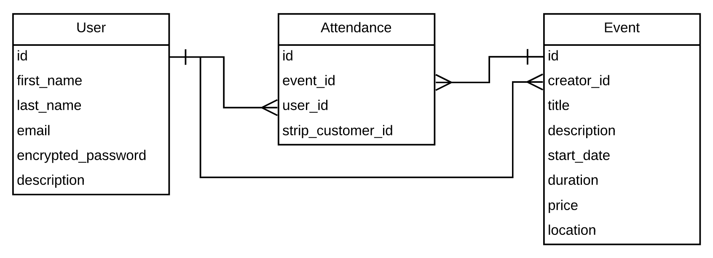

<h1>Bdx Event Project 💻</h1>

Bdx Event est un clone de Eventbrite à Bordeaux (en cours).

* Ruby version 2.5.1
* Rails version 5.2.3
* `bundle install`
* `rails db:create`
* `rails db:migrate`
* `rails db:seed`
* `rails server`
* en local : `http://localhost:3000/`
* en production : `https://bdx-event.herokuapp.com/`

<h2>Tables</h2>

Les différentes tables : 
* `users` : tous nos utilisateurs, qui peuvent être des créateurs d'évènements et des participants également
* `events` : les évènements, qui sont créés par un utilisateur avec des attributs classiques comme date de début, lieu, prix, titre, description
* `attendances` : table qui fait le lien entre les utilisateurs et les évènements créés, il y a un nouvel objet `Attendance` créé pour chaque nouveau participant à un évènement

<h2>Architecture</h2>

<h2>Améliorations possibles</h2>

* ajouter paramètre admin à un user (https://roberteshleman.com/blog/2014/08/14/using-rails-namespaces-for-admin-actions/)
* restrictions à faire
* système de tags pour les évènements
* pouvoir classer les évènements affichés sur index par tags
* ...
* design DONE
* mettre stripe en production DONE

--------

Fait par [Ladislas](https://github.com/ladislasfontaine) 🤙 en utilisant les ressources de [The Hacking Project](https://www.thehackingproject.org)